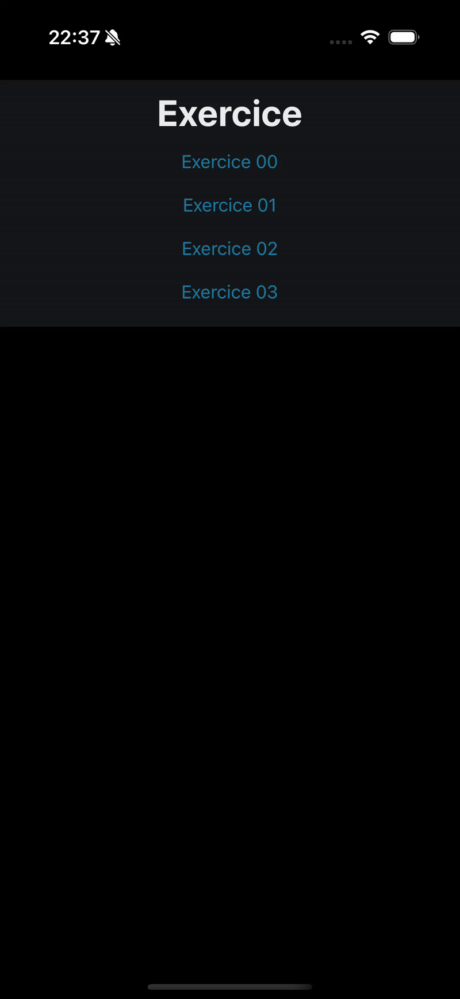

# 📱 Mobile 0 – Introduction to Mobile Development with Expo

This repository contains solutions for **Module 00** of the **42 Piscine Mobile**, reimplemented using **React Native with Expo**. The purpose of this module is to progressively build UI and interactivity skills by creating a basic but functional **calculator app**.

---

## 🧩 Exercises Overview

| Exercise | Title                    | Description                                                                 |
|---------:|--------------------------|-----------------------------------------------------------------------------|
| ex00     | A Basic Display          | Display a centered text and a button, with basic console interaction.      |
| ex01     | Say Hello to the World   | Toggle text on button press.                                               |
| ex02     | More Buttons             | Create the calculator UI with buttons and display zones.                   |
| ex03     | It’s Alive!              | Add calculator logic to process expressions and show results.              |

---

## 🎬 Preview



---

## 🚀 Getting Started

### 🔧 Requirements

- [Node.js](https://nodejs.org/)
- [Expo CLI](https://docs.expo.dev/get-started/installation/)
- Expo Go app (iOS/Android) **or** an emulator

### 📦 Installation & Launch

1. Install dependencies:
   ```bash
   npm install
   ```
2. Start the Expo development server:
   ```bash
   npm run start
   ```
3. Scan the QR code in your Expo Go app or press i/a to open it in iOS/Android emulator.